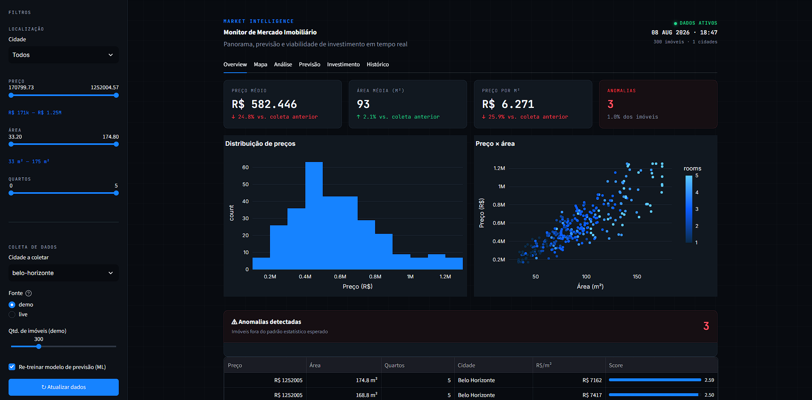

# 🏠 Real Estate Monitor

> Plataforma de inteligência de mercado imobiliário com **Machine Learning, análise de investimentos, histórico de preços e alertas automáticos**.

O **Real Estate Monitor** coleta, processa e analisa dados imobiliários para gerar insights sobre **preços, oportunidades de investimento e tendências de mercado**.

A aplicação funciona **sem serviços externos obrigatórios**, utilizando SQLite e dados sintéticos realistas por padrão. O scraping de dados reais está disponível em modo *best-effort*, com fallback automático para dados de demonstração.

<p align="center">
  
</p>

---

## 📋 Sumário

* [🛠️ Stack](#️-stack)
* [✨ Funcionalidades](#-funcionalidades)
* [🤖 Machine Learning](#-machine-learning)
* [💰 Investment Intelligence](#-investment-intelligence)
* [🔌 API](#-api)
* [🚀 Quick Start](#-quick-start)
* [🐳 Docker](#-docker)
* [🧭 CLI](#-cli)
* [📁 Estrutura](#-estrutura)
* [⚠️ Observação](#️-observação)

---

## 🛠️ Stack

### Backend & API

* **Python 3.11+**
* **FastAPI**
* **Uvicorn**
* **Pydantic**

### Data Science & Machine Learning

* **Pandas**
* **NumPy**
* **Scikit-learn**

  * Random Forest
  * K-Means
  * Z-Score
  * IQR

### Database & Storage

* **SQLite**
* **PostgreSQL** *(opcional)*
* **SQLAlchemy**
* Cache em memória

### Dashboard

* **Streamlit**
* **Plotly**

### Data Collection

* **Requests**
* **BeautifulSoup**
* Scraping *best-effort*
* Gerador de dados sintéticos

### DevOps & Testing

* **Docker**
* **Docker Compose**
* **Pytest**
* **PowerShell**
* **Bash**

---

## ✨ Funcionalidades

|     | Funcionalidade                                |
| --- | --------------------------------------------- |
| 📊  | Coleta e tratamento de dados imobiliários     |
| 🤖  | Previsão de preços com **Random Forest**      |
| 📈  | Histórico de preços e tendências              |
| 🔔  | Detecção de anomalias e alertas               |
| 💰  | Análise de investimento, ROI, yield e payback |
| 🗺️ | Análise por cidade e bairro                   |
| 🧠  | Clusterização com K-Means                     |
| 🔌  | API REST com FastAPI                          |
| 🎨  | Dashboard interativo com Streamlit            |
| 💾  | SQLite + PostgreSQL                           |
| 🐳  | Docker                                        |
| 🧪  | Testes automatizados                          |

---

## 🤖 Machine Learning

O modelo `RandomForestRegressor` estima preços utilizando diferentes características dos imóveis:

* Área
* Quartos
* Banheiros
* Cidade
* Bairro

O módulo também disponibiliza métricas e informações para avaliação do modelo:

* **R²**
* **MAPE**
* Importância das variáveis
* Intervalo de confiança aproximado

### Fluxo de previsão

```text
Dados imobiliários
       │
       ▼
Pré-processamento
       │
       ▼
Feature Engineering
       │
       ▼
Random Forest
       │
       ├── Preço estimado
       ├── R²
       ├── MAPE
       └── Importância das variáveis
```

---

## 💰 Investment Intelligence

O módulo de inteligência de investimentos calcula diferentes indicadores para avaliar oportunidades imobiliárias:

* Aluguel estimado
* Yield bruto
* Yield líquido
* Payback
* Custos de transação
* Preço por m²
* Comparação com o mercado local

Também é possível gerar um **ranking das melhores oportunidades de investimento** com base nos indicadores calculados.

### Indicadores

```text
                    ┌─────────────────────┐
                    │   Imóvel analisado  │
                    └──────────┬──────────┘
                               │
              ┌────────────────┼────────────────┐
              ▼                ▼                ▼
          Preço/m²        Aluguel          Mercado local
              │                │                │
              └────────────────┼────────────────┘
                               ▼
                    ┌─────────────────────┐
                    │ Investment Analysis │
                    └──────────┬──────────┘
                               │
              ┌────────────────┼────────────────┐
              ▼                ▼                ▼
           Yield            Payback             ROI
```

---

## 🔌 API

A API foi construída com **FastAPI** e possui documentação automática através do Swagger.

Após iniciar a aplicação, a documentação estará disponível em:

```text
http://localhost:8000/docs
```

### Endpoints

| Método | Endpoint                    | Função                   |
| ------ | --------------------------- | ------------------------ |
| `GET`  | `/listings`                 | Lista imóveis            |
| `GET`  | `/stats`                    | Estatísticas do mercado  |
| `GET`  | `/neighborhoods`            | Dados por bairro         |
| `POST` | `/predict`                  | Previsão de preço        |
| `POST` | `/investment`               | Análise de investimento  |
| `GET`  | `/investment/opportunities` | Ranking de oportunidades |
| `GET`  | `/alerts`                   | Alertas                  |
| `GET`  | `/history/{city}`           | Histórico                |
| `POST` | `/pipeline/run`             | Executa pipeline         |

---

## 🚀 Quick Start

### Windows

```powershell
.\scripts\quick_start.ps1
```

### Linux / macOS

```bash
./scripts/quick_start.sh
```

### Instalação manual

Crie o ambiente virtual:

```bash
python -m venv venv
```

#### Windows

```powershell
venv\Scripts\Activate.ps1
```

#### Linux / macOS

```bash
source venv/bin/activate
```

Instale as dependências:

```bash
pip install -r requirements.txt
```

Execute a aplicação:

```bash
python main.py run
```

### Acessos

**Dashboard:**

```text
http://localhost:8501
```

**API / Swagger:**

```text
http://localhost:8000/docs
```

---

## 🐳 Docker

O projeto também pode ser executado utilizando Docker Compose.

```bash
docker compose up --build
```

Após a inicialização:

```text
Dashboard → http://localhost:8501
API       → http://localhost:8000
Swagger   → http://localhost:8000/docs
```

---

## 🧭 CLI

O projeto possui uma CLI para facilitar a execução das principais operações.

### Executar aplicação completa

```bash
python main.py run
```

### Executar utilizando dados reais

```bash
python main.py run --source live
```

### Executar scraping

```bash
python main.py scrape
```

### Iniciar apenas o dashboard

```bash
python main.py dashboard
```

### Iniciar apenas a API

```bash
python main.py api
```

### Cidades disponíveis nos dados de demonstração

```text
São Paulo
Rio de Janeiro
Belo Horizonte
Curitiba
Porto Alegre
```

---

## 📁 Estrutura

```text
real-estate-monitor/
│
├── config/                  # Configurações
│
├── src/
│   ├── data_ingestion/      # Coleta e dados de demonstração
│   ├── data_processing/    # Analytics, ML e investimentos
│   ├── data_storage/       # Banco de dados e cache
│   ├── alerts/             # Sistema de alertas
│   ├── orchestration/      # Pipeline de processamento
│   ├── api/                # FastAPI
│   └── visualization/      # Dashboard Streamlit
│
├── tests/                  # Testes automatizados
├── scripts/                # Scripts de inicialização
├── main.py                 # CLI principal
├── requirements.txt        # Dependências
├── docker-compose.yml      # Orquestração Docker
└── README.md
```

### Responsabilidades

| Módulo            | Responsabilidade                              |
| ----------------- | --------------------------------------------- |
| `data_ingestion`  | Coleta de dados e geração de dados sintéticos |
| `data_processing` | Tratamento, análise, ML e indicadores         |
| `data_storage`    | Persistência e cache                          |
| `alerts`          | Detecção de anomalias e geração de alertas    |
| `orchestration`   | Coordenação do pipeline                       |
| `api`             | Exposição dos dados através de REST           |
| `visualization`   | Dashboard e visualizações interativas         |
| `tests`           | Testes automatizados                          |
| `scripts`         | Automação de execução e setup                 |

---

## 🔄 Pipeline de dados

O processamento segue um fluxo dividido em etapas:

```text
┌──────────────────────┐
│  Fonte de dados      │
│  Demo / Scraping     │
└──────────┬───────────┘
           │
           ▼
┌──────────────────────┐
│ Data Ingestion       │
└──────────┬───────────┘
           │
           ▼
┌──────────────────────┐
│ Data Processing      │
│ Limpeza + Analytics  │
└──────────┬───────────┘
           │
           ├───────────────────┐
           ▼                   ▼
┌──────────────────┐   ┌──────────────────┐
│ Machine Learning │   │ Investment       │
│ Price Prediction │   │ Intelligence     │
└────────┬─────────┘   └────────┬─────────┘
         │                      │
         └──────────┬───────────┘
                    ▼
          ┌──────────────────┐
          │ Storage / Cache  │
          └────────┬─────────┘
                   │
          ┌────────┴─────────┐
          ▼                  ▼
   ┌─────────────┐    ┌─────────────┐
   │  FastAPI    │    │  Streamlit  │
   │     API     │    │  Dashboard  │
   └─────────────┘    └─────────────┘
```

---

## 📊 Arquitetura da solução

```text
                    ┌─────────────────────┐
                    │       Usuário       │
                    └──────────┬──────────┘
                               │
                 ┌─────────────┴─────────────┐
                 │                           │
                 ▼                           ▼
        ┌─────────────────┐        ┌─────────────────┐
        │    Streamlit    │        │     FastAPI     │
        │    Dashboard    │        │       API       │
        └────────┬────────┘        └────────┬────────┘
                 │                          │
                 └────────────┬─────────────┘
                              ▼
                    ┌──────────────────┐
                    │ Business Logic   │
                    └────────┬─────────┘
                             │
              ┌──────────────┼──────────────┐
              ▼              ▼              ▼
       ┌────────────┐ ┌────────────┐ ┌──────────────┐
       │ Analytics  │ │ ML Models  │ │ Investment   │
       │            │ │            │ │ Intelligence │
       └─────┬──────┘ └─────┬──────┘ └──────┬───────┘
             │              │               │
             └──────────────┼───────────────┘
                            ▼
                   ┌─────────────────┐
                   │ Storage / Cache │
                   └────────┬────────┘
                            ▼
                   ┌─────────────────┐
                   │ SQLite /        │
                   │ PostgreSQL      │
                   └─────────────────┘
```

---

## 🔔 Alertas e anomalias

O sistema possui mecanismos para identificar comportamentos fora do padrão no mercado imobiliário.

Entre as técnicas utilizadas estão:

* **Z-Score**
* **IQR (Interquartile Range)**
* Análise histórica
* Comparação de preços por região
* Detecção de oportunidades abaixo do mercado

Esses mecanismos podem ser utilizados para identificar imóveis com características como:

```text
Preço muito abaixo da média
          ↓
Detecção de anomalia
          ↓
Análise do imóvel
          ↓
Possível oportunidade
          ↓
Alerta
```

---

## 🧠 Clusterização

O **K-Means** é utilizado para agrupar imóveis com características semelhantes.

Os agrupamentos podem considerar fatores como:

* Preço
* Área
* Preço por m²
* Quantidade de quartos
* Localização
* Indicadores de investimento

Isso permite identificar diferentes perfis de imóveis e regiões dentro do mercado analisado.

---

## 🧪 Testes

O projeto utiliza **Pytest** para testes automatizados.

Execute:

```bash
pytest
```

Para obter informações detalhadas:

```bash
pytest -v
```

---

## ⚠️ Observação

Os **dados sintéticos, previsões de Machine Learning e estimativas de aluguel/yield** são destinados a **prototipagem, estudos e demonstração técnica**.

A precisão dos resultados depende diretamente da qualidade, quantidade e atualidade dos dados utilizados.

As análises apresentadas **não substituem avaliação imobiliária, financeira ou profissional especializada**.

---

## 🎯 Objetivos do projeto

O **Real Estate Monitor** foi desenvolvido para demonstrar, em um único projeto, a integração entre:

* Engenharia de dados
* APIs REST
* Machine Learning
* Data Science
* Análise estatística
* Inteligência de investimentos
* Detecção de anomalias
* Visualização de dados
* Automação de pipelines
* Persistência de dados
* Desenvolvimento de dashboards
* Containerização com Docker
* Testes automatizados

O projeto combina **engenharia de software + dados + inteligência de negócio** em uma aplicação voltada para um problema real.

---

<div align="center">

## 🏠 Real Estate Monitor

**Inteligência de mercado imobiliário baseada em dados, Machine Learning e análise de investimentos.**

Desenvolvido com 🐍 **Python** · ⚡ **FastAPI** · 🤖 **Scikit-learn** · 📊 **Streamlit**

</div>
